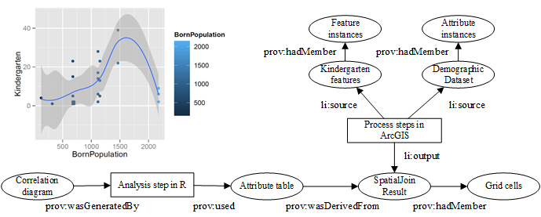
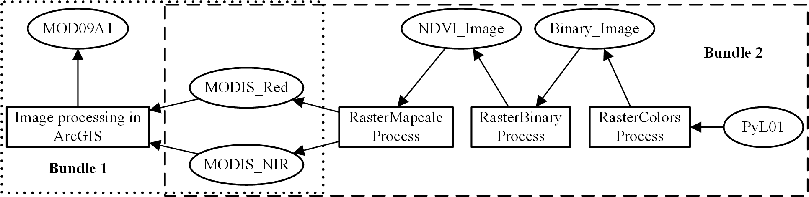

Usage examples of geospatial data provenance
=============================================
*Abstract:* Two use cases are provided to demonstrate the use of geospatial data provenance. The first use case (watercov) records 
the provenance information of a geoscientific workflow which is used to derive water coverage areas from Earth observation data. 
Another use case (govdata) presents provenance descriptions of a correlation analysis between two groups of open government data.
Note that data sources involved in the "govdata" use case are also exposed as linked data. 

Content
----------------------
- [`govdata/`](govdata): proveanance example about vector data.
- [`watercov/`](watercov): provenance example about raster data.

Content
----------------------
The following figures present graphical illustrations of the provenance information in the two use cases.
 - #### govdata use case    
   
 -  #### watercov use case    
   

