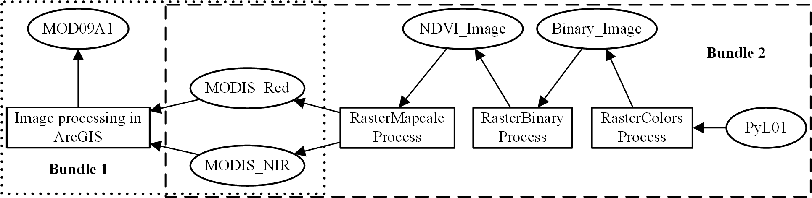
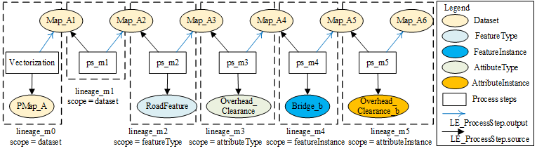
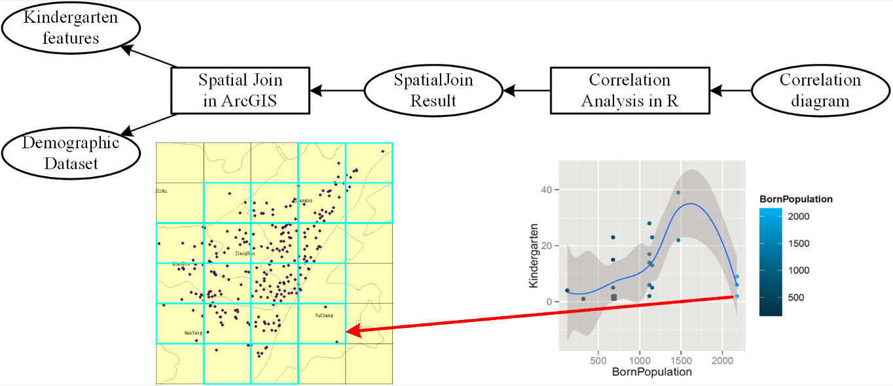

Usage examples of geospatial data provenance
=============================================
*Abstract:* Three use cases are provided to demonstrate the use of geospatial data provenance. The first use case (waterCoverage) records 
the provenance information of a geoscientific workflow which is used to derive water coverage areas from Earth observation data. 
Another use case (govdata) presents provenance descriptions of a correlation analysis between two groups of open government data.
Note that data sources involved in the "govdata" use case are also exposed as linked data. 

Contents
----------------------
- [`waterCoverage/`](waterCoverage): provenance example about raster data.
- [`mapUpdate/`](mapUpdate/`): proveanance example about vector data.
- [`govData/`](govData): proveanance example about vector data.

Descriptions
----------------------
The following figures present graphical illustrations of the provenance information in the three use cases.
-  #### Case I: Raster processing workflow    
   In this use case, a GIS analyst (John) was utilizing Earth Observation Data (MOD09A1) and GIS tools to detect the water body of Poyang Lake in China. He developed a geoscientific workflow as follows and produced a result (PyL01) using the workflow. The workflow is a composite one that contains two sub workflows: image preprocessing in ArcGIS including coordinate system transformation, image clipping, and band extraction, and a geoprocessing service chain using ([GeoPW] (http://geos.whu.edu.cn:8080/wps10/wpsprocesses.html)). The service chain contains four services: RasterMapcalcProcess calculates Normalized Difference Vegetation Index (NDVI) using surface reflectances in the red (MODIS_Red) and near-infrared spectral bands (MODIS_NIR) of the MOD09A1 dataset; RasterBinaryProcess extracts the water coverage by binarizing the output of the first process step; and RasterColorsProcess modifies the color table associated with the binary image. The preprocessing and service chain were carried out by different individuals, on different dates, and in different platforms (ArcGIS and GeoPW). So their provenance information was recorded in two lineage bundles (Bundle1 and Bundle2).
   

-  #### Case II: Provenance tracking in online map updates
   Consider a mapping agency (Agent_M) responsible for producing and maintaining an online map for an administrative region A. The map (Map_A) went through the following updates (versions): 1) the map (Map_A1) was initially derived from a paper map (PMap_A). 2) After some time, a refined version (Map_A2) of Map_A was available. 3) Later, the road network (RoadFeature) in the region A was resurveyed. 4) In the last road survey, all overhead clearances had been surveyed to the nearest meter, which was not suitable for some applications. To improve its precision, the attribute type “overhead clearance” for A was resurveyed to nearest decimeter. 5)  A new feature (Bridge_b) was constructed in A, and added to the vector map (Map_A5). 6) The overhead clearance attribute of b was wrongly recorded, and modified in the new version of the map (Map_A6). Provenance was documented during each map update.
   

- #### Provenance for correlation analysis in the open government data exploration   
   Supposing that a demographer produced a correlation diagram between the number of kindergartens and the population of births in the city of Wuhan, China. Two data sources were used: point-based kindergarten features and demographic dataset. He first joined the two data sources in ArcGIS, and got a grid-based “SpatialJoin” result with “kindergarten number” and “newborn population” properties. Then he ran correlation analysis using these two properties in R and produced the correlation result. Fig. 4 shows a graphical illustration of provenance in this use case. Each dot in the result diagram represents a grid cell in the “SpatialJoin” result. The result diagram shows some abnormal “dots” where the born population is high while the number of kindergartens is low. Users may want to trace these “dots” with the assistance of provenance descriptions and find out which administrative regions those cells with abnormal “dots” are located in.
   

